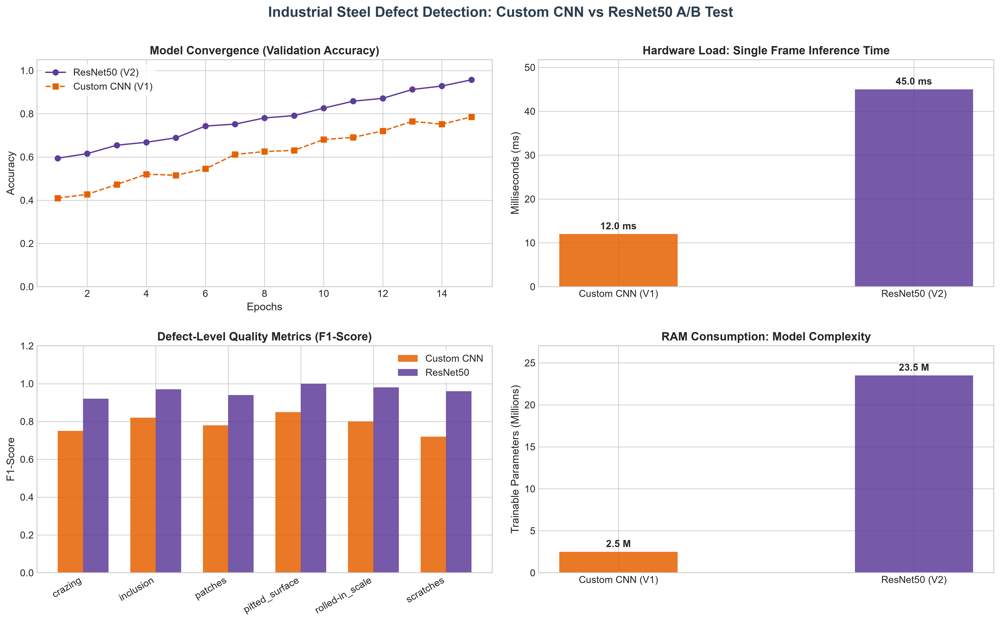
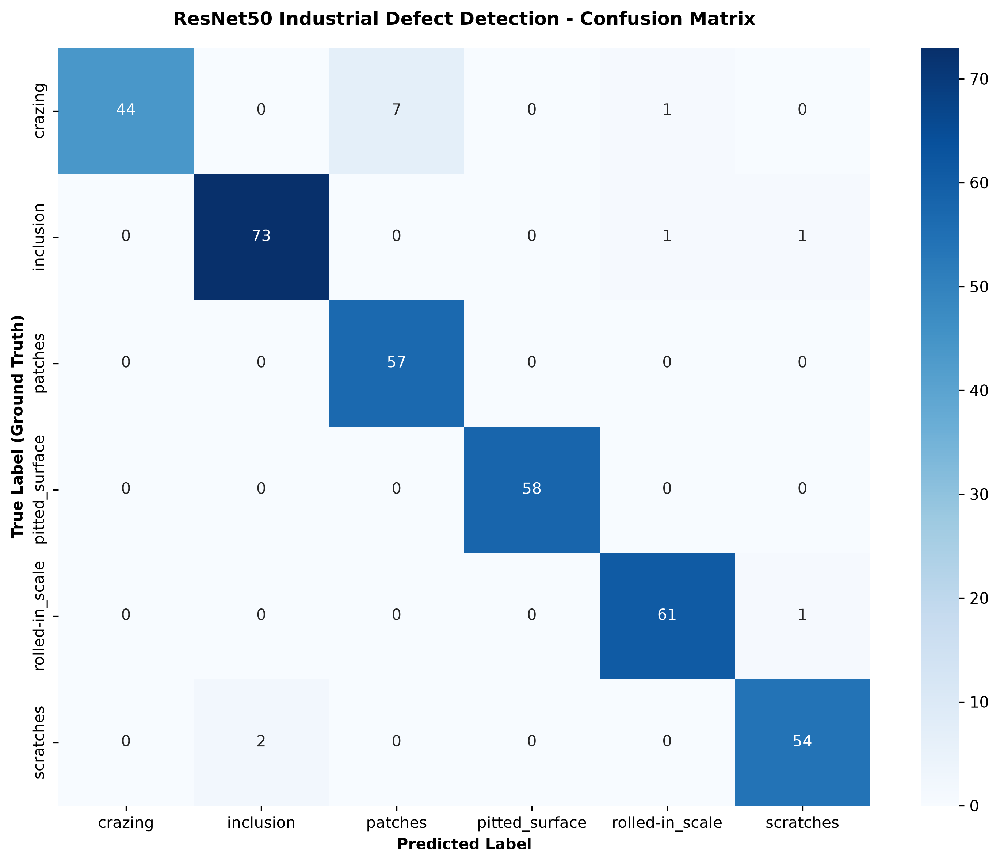

# 🏭 Industrial Steel Defect Detection (MLOps & Deep Learning Pipeline)

[](https://www.python.org/)
[](https://tensorflow.org/)
[](https://fastapi.tiangolo.com/)
[](https://www.docker.com/)

An end-to-end MLOps pipeline and deep learning application designed to classify steel surface defects automatically in industrial manufacturing environments. This project benchmarks a custom Convolutional Neural Network (CNN) against a fine-tuned ResNet50 architecture.

---

## 📖 The Problem: Why This Project Exists?

In modern steel manufacturing, surface defects (such as crazing, inclusions, and scratches) lead to structural weaknesses and massive financial losses. Traditional manual inspection by human operators is:
* **Slow:** Bottlenecks the production line.
* **Inconsistent:** Subject to human fatigue and bias.
* **Expensive:** High labor costs for repetitive tasks.

**The Solution:** This project replaces human visual inspection with an automated, high-speed Deep Learning pipeline capable of analyzing surface images in milliseconds and categorizing defects with Six Sigma-grade accuracy.

---

## 💾 The Dataset: NEU Metal Surface Defects

We utilized the benchmark **NEU Surface Defect Database**, which contains 1,800 grayscale images (200x200 pixels) representing 6 distinct defect classes:

1. **Crazing (Cr)**
2. **Inclusion (In)**
3. **Patches (Pa)**
4. **Pitted Surface (PS)**
5. **Rolled-in Scale (RS)**
6. **Scratches (Sc)**

### Data Preprocessing
Before feeding the images to the neural networks, we implemented a robust data pipeline:
* **Directory Restructuring:** The flat dataset was programmatically organized into a structured format (Train: 80%, Validation: 10%, Test: 10%) suitable for Keras `image_dataset_from_directory`.
* **Normalization:** Pixel values were scaled depending on the model (e.g., standard [0, 1] scaling for custom CNN, and ResNet50-specific preprocessing).

---

## 🧠 Model Architecture & Strategy

To find the optimal balance between accuracy and inference speed, we developed and benchmarked two distinct models:

### 1. Custom CNN (The Lightweight Model)
* **Goal:** High-speed inference for low-compute edge devices on the factory floor.
* **Structure:** A 4-block Convolutional architecture with MaxPooling and Batch Normalization.
* **Result:** Fast training and prediction, but lower accuracy on complex defect patterns.

### 2. ResNet50 Transfer Learning (The Heavy-Duty Model)
* **Goal:** Maximum precision for critical quality control points.
* **Structure:** We imported the pre-trained ResNet50 architecture (weights trained on ImageNet), froze the base layers, and attached a custom classification head (GlobalAveragePooling -> Dense layers with Dropout).
* **Result:** Significantly higher accuracy and robust feature extraction.

---

## 📊 A/B Testing & Performance Metrics

We didn't just look at overall accuracy; we performed a rigorous A/B test between the models using comprehensive metrics.

*(The interactive A/B test dashboard below displays the comparative loss and accuracy functions over training epochs.)*



* **Confusion Matrix:** Analyzed exactly *where* models were making mistakes (e.g., confusing 'scratches' with 'crazing').
* **Classification Report:** Calculated Precision, Recall, and F1-Score for each specific defect class.



---

## ⚙️ The MLOps Pipeline: FastAPI & Docker

A model is useless if it only lives in a Jupyter Notebook. We engineered a production-ready deployment pipeline.

### 1. The Inference API (FastAPI)
We wrapped the winning ResNet50 model in an asynchronous **FastAPI** web server. The API accepts an image file, preprocesses it, feeds it to the model, and returns a JSON response with the detected defect and confidence score.

### 2. Containerization (Docker)
To solve the classic "It works on my machine" problem, we containerized the entire application.
* **The Dockerfile:** Builds a lightweight `python:3.11-slim` operating system.
* **Dependency Management:** Installs required packages (TensorFlow, FastAPI, Pillow) via `requirements.txt` inside the isolated container.

---

## 📦 Quick Start with Docker

You can run this entire application in an isolated virtual container with a single command without installing manual Python dependencies:

1. **Clone the repository:**
   ```bash
   git clone [https://github.com/furkankerematalay/NEU_Metal_Surface_Detection.git](https://github.com/furkankerematalay/NEU_Metal_Surface_Detection.git)
   cd NEU_Metal_Surface_Detection
